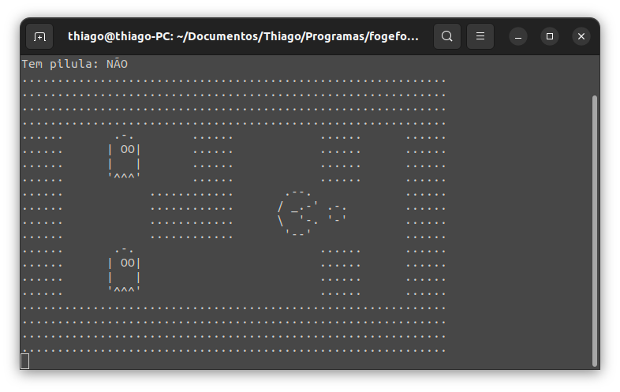
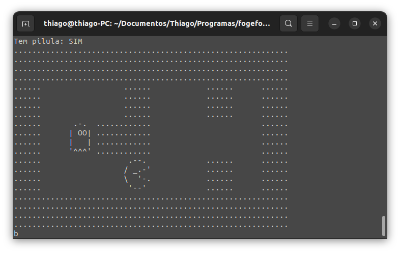

# Jogo Foge-Foge | Alura

Este é um jogo semelhante ao classico Pac-Man feito para jogar no terminal.

## Screenshots




## Como rodar

1. Pelo Terminal, compile o jogo:
    ```bash
    gcc fogefoge.c mapa.c ui.c -o fogefoge
    ```

2. Execute o jogo compilado.
    ```bash
    ./fogefoge
    ```

## Como jogar

- **W**: Move para cima.
- **S**: Move para baixo.
- **D**: Move para direita.
- **A**: Move para esquerda.
- **B**: Explode a bomba.

## Contribuindo

- Sinta-se à vontade para contribuir com melhorias, novas funcionalidades ou correções de bugs.

## Créditos

- Este projeto foi realizado seguindo o curso "C: recursos avançados da linguagem" da Alura: https://cursos.alura.com.br/course/introducao-a-programacao-com-c-parte-3
- Criado pelo instrutor **Maurício Aniche**.